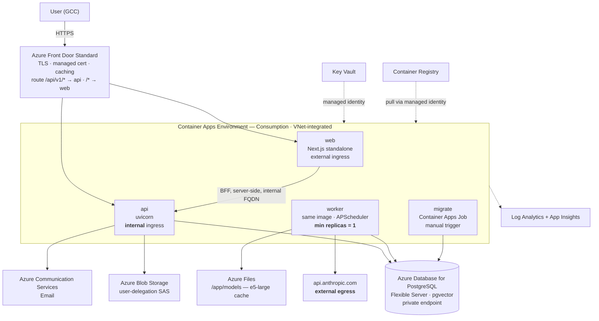

# Deploying NEXUS OS on Azure

A plan derived from what the repository actually contains — `docker-compose.yml`,
the two Dockerfiles, `.env.example`, `app/storage.py`, `app/mail.py`, and
`ARCHITECTURE-HLD.md` §9 — not from a generic template.

> **Costs below are approximate USD/month list prices**, sized against
> **UAE North** (nearest region to the Oman/GCC market the README targets).
> Azure prices change and vary by region; treat every figure as a planning
> estimate to be re-checked in the Azure Pricing Calculator before commitment.
> UAE North typically runs 5–15% above East US on compute. UAE billing adds 5% VAT.

---

## 1. What is being deployed

| Component | What it is | Today |
|---|---|---|
| `services/api` | Python 3.12 · FastAPI · uvicorn · non-root · `/health` + `/health/ready` | Dockerfile ✅ |
| `worker` | **Same image**, `python -m app.worker`, `NEXUS_RUN_SCHEDULER=true` (APScheduler) | Dockerfile ✅ |
| `migrate` | **A job, not a service** — `alembic upgrade head`, must exit 0 before api/worker start | Compose job ✅ |
| `apps/web` | Next.js 14 App Router, `output: 'standalone'`, acts as the **BFF** (server-side fetch to api) | Dockerfile ✅ |
| `db` | Postgres 17/18 + **pgvector**, **forced RLS**, two roles (app + jobs) | Neon today; pgvector image locally |
| `proxy` | Caddy — TLS termination so `secure=True` cookies work; routes `/api/v1/*` → api (path-stripped), `/*` → web | Local only |
| Object store | `FilesystemObjectStore` writing `.storage/`, signed URLs | **Needs a cloud driver** |
| Mailer | `FileMailer` (local) / `SmtpMailer` (exists, unwired) — D4 still open | **Needs a provider** |
| Embeddings | **Local** multilingual-e5-large ONNX, ~2 GB download, 1024 dims (ADR 0003 — text never leaves) | Optional extra |
| Language model | **Anthropic Claude** via `NEXUS_ANTHROPIC_API_KEY` (ADR 0011), optional | External API |

Two facts shape everything below:

1. **The whole product is four containers and one job.** That maps onto Azure
   Container Apps almost exactly — including the job, which Container Apps Jobs
   models natively. This is not a Kubernetes-shaped problem.
2. **Same-origin matters.** The session cookie is `Secure` + `SameSite=Lax`
   (`app/auth/csrf.py`). Caddy serves web and api from one hostname. Container
   Apps gives each app its **own** FQDN, so something has to restore the single
   origin or the session layer breaks. See §4.

---

## 2. Target architecture



---

## 3. Azure service map

### Core — you need all of these

| Azure service | Replaces / serves | Why this one |
|---|---|---|
| **Container Apps** (Consumption) | `api`, `web`, `worker` containers | Scale-to-zero, per-app ingress with free managed TLS, no cluster to operate. No environment base fee on Consumption-only. |
| **Container Apps Jobs** | the `migrate` job | Runs to completion and reports exit code — exactly the `service_completed_successfully` semantic the compose file insists on. Migrations stay a deploy step you can watch fail. |
| **Azure Database for PostgreSQL — Flexible Server** | `db` | Managed Postgres with **pgvector** (allowlist `VECTOR` in the `azure.extensions` server parameter). Supports the two-role + forced-RLS model. |
| **Azure Container Registry** | image storage | Managed-identity pull from Container Apps, no registry credentials in config. |
| **Azure Blob Storage** | `FilesystemObjectStore` | Signed-URL-only access via **user-delegation SAS** (identity-signed, not account-key-signed). Needs a new driver — §5.1. |
| **Key Vault** | the five required secrets | Container Apps secret references resolve from Key Vault via managed identity; secrets never sit in revision config. |
| **Log Analytics + Application Insights** | container logs, traces | Container Apps' native log destination. Watch the cost — §6.4. |
| **Managed Identity** (user-assigned) | ACR pull, Key Vault, Blob, Postgres | One identity shared by api/worker/job so RBAC is granted once. |

### Strongly recommended

| Azure service | For | Note |
|---|---|---|
| **Azure Front Door Standard** | single origin + path routing + WAF-lite | Restores the Caddy layout: `/api/v1/*` → api origin **with path rewrite**, `/*` → web. Also the answer to §2's cookie problem. Custom WAF rules on Standard; **managed** WAF rulesets need Premium. |
| **Azure Communication Services — Email** | D4, the open email decision | Verified custom sending domain, bounce/suppression handling, $0.00025/email. `SmtpMailer` already exists — ACS offers an SMTP relay, so this may be config-only. |
| **Azure Files** (SMB) | `/app/models` — the ~2 GB e5-large cache | Mounted into api/worker so the model downloads once and is shared, instead of baking 2 GB into every image. Alternatives in §5.7. |
| **Private Endpoints** | Postgres, Blob, Key Vault | Keeps data-plane traffic off the public internet. Private ACR needs **Premium** tier. |

### Optional / later

| Azure service | When |
|---|---|
| **Azure OpenAI (`text-embedding-3-large`)** | If you decide to stop self-hosting the embedder. Set `dimensions=1024` and it matches `NEXUS_EMBEDDING_DIM` — but see §7.5, a model swap is a data migration. |
| **Front Door Premium / App Gateway WAF v2** | When you want Microsoft-managed OWASP rulesets and private-link origins. |
| **Defender for Cloud** (Containers + Databases plans) | Multi-tenant customer data; image scanning + DB threat detection. |
| **Azure Backup / long-term retention** | Beyond Flexible Server's 35-day PITR window. |
| **Read replica** | When reporting queries start competing with the transactional path. |
| **Neon Serverless Postgres (Azure Native ISV Service)** | If you'd rather **keep Neon** — it's an Azure Marketplace offer, billed through your Azure invoice. Zero migration, one bill. See §7.4. |

### Not on Azure

**Claude is not an Azure first-party model.** `NEXUS_ANTHROPIC_API_KEY` will keep
calling `api.anthropic.com` as outbound egress from Container Apps — which is
fine, but it means one dependency sits outside your Azure boundary and outside
Azure billing. If in-boundary inference is a requirement, `app/ai/registry.py`
already abstracts providers, so an Azure OpenAI provider is a clean addition
rather than a rewrite. That's a decision, not a blocker — §7.3.

---

## 4. Costing

### Scenario A — Dev / Staging
Scale-to-zero, single replicas, burstable database, no Front Door, no private endpoints.

| Service | Configuration | $/mo |
|---|---|---:|
| Container Apps environment | Consumption-only — no base fee | 0 |
| Container Apps compute | 3 apps, mostly idle/scaled-to-zero (~0.5 vCPU avg) | 20–35 |
| PostgreSQL Flexible Server | **B1ms** burstable, 1 vCore / 2 GiB, 32 GiB storage, 7-day PITR | 17 |
| Container Registry | **Basic**, 10 GiB included | 5 |
| Blob Storage | 50 GiB Hot LRS + transactions | 2 |
| Azure Files | Standard SMB, 100 GiB (model cache) | 6 |
| Key Vault | Standard, low operation count | 1 |
| Log Analytics / App Insights | ~5 GiB ingest, 31-day retention | 14 |
| ACS Email | ~2,000 emails | <1 |
| **Total** | | **≈ 65–80** |

*Free monthly grant per subscription (180k vCPU-s + 360k GiB-s ≈ $5) is already netted out.*

### Scenario B — Production, small
A few hundred users, one region, no database HA. This is the realistic launch shape.

| Service | Configuration | $/mo |
|---|---|---:|
| Container Apps compute | api 2×(0.5 vCPU/1 GiB) · web 2×(0.5/1) · worker 1×(1/4, holds the embedder) — blended active/idle billing | 140–200 |
| PostgreSQL Flexible Server | **D2ds_v5** General Purpose, 2 vCore / 8 GiB, 128 GiB Premium SSD, 14-day PITR | 155 |
| Container Registry | **Standard**, 100 GiB (large images, many tags) | 20 |
| Blob Storage | 500 GiB Hot LRS + transactions + egress | 12 |
| Azure Files | Standard SMB, 100 GiB | 6 |
| Key Vault | Standard | 1 |
| Front Door | **Standard** base + ~100 GiB egress + routes | 40 |
| Log Analytics / App Insights | ~25 GiB ingest, 31-day retention | 70 |
| ACS Email | ~20,000 emails | 6 |
| Private Endpoints | 4 × $7.30 + data processing | 32 |
| **Subtotal (Azure)** | | **≈ 480–540** |
| Anthropic API | usage-based, **not Azure** — budget separately | — |

**Levers:** 1-year reserved capacity on the Postgres compute cuts ~35–38%
(≈ −$55/mo). Dropping Front Door and letting the Next.js BFF proxy `/api/v1`
saves $40 but gives up caching, WAF rules, and origin shielding.

### Scenario C — Production, HA + WAF
Thousands of users, zone-redundant database, managed WAF, longer retention.

| Service | Configuration | $/mo |
|---|---|---:|
| Container Apps compute | api 3×(1/2) · web 3×(0.5/1) · worker 2×(2/4), higher utilisation | 450–600 |
| PostgreSQL Flexible Server | **D4ds_v5**, 4 vCore / 16 GiB, **zone-redundant HA** (doubles compute + storage), 256 GiB | 620 |
| Container Registry | **Premium** (private endpoint, 500 GiB) | 50 |
| Blob Storage | 2 TiB, lifecycle rules to Cool | 40 |
| Azure Files | Premium SMB, 100 GiB | 16 |
| Front Door | **Premium** (managed WAF rulesets, private-link origins) + 500 GiB | 345 |
| Log Analytics / App Insights | ~100 GiB ingest, 90-day retention | 300 |
| ACS Email | ~100,000 emails | 28 |
| Private Endpoints | 5 + data processing | 40 |
| Defender for Cloud | Containers + Databases plans | 40 |
| **Subtotal (Azure)** | | **≈ 1,900–2,100** |

### The three cost surprises, in order

1. **Log Analytics ingest** — $2.76/GiB adds up fast and silently. Set a
   **daily cap** and App Insights **sampling** on day one, before you have a
   $300 line item you can't explain.
2. **Always-on replicas** — Container Apps bills active vCPU ~8× idle. `min
   replicas = 0` wherever a cold start is survivable. The **worker cannot**
   scale to zero (§5.9), so it is your compute floor.
3. **Front Door Premium** — $330/mo of base fee for managed WAF. Start on
   Standard with custom rules and only move up when you need the managed rulesets.

---

## 5. Code and configuration work

Ordered by whether it blocks a first deploy.

### Blocking

**5.1 · Blob storage driver** — `services/api/app/storage.py`
`ObjectStore` is already an ABC with `FilesystemObjectStore` behind it, so this
is one new class, not a refactor. Add `AzureBlobObjectStore`, switch on
`NEXUS_STORAGE_BACKEND=azure_blob`. Sign with **user-delegation SAS** so URLs
are identity-signed and no account key exists to leak; the managed identity
needs `Storage Blob Data Contributor` **and** `Storage Blob Delegator`.
Keep `workspace_key()` as the key layout unchanged. **~1–2 days.**

**5.2 · Database bootstrap** — port `docker/postgres/init/01-app-role.sh` + `db/bootstrap.sql`
Flexible Server gives you `azure_pg_admin`, **not** a superuser. Three things to
prove before anything else:
- `CREATE EXTENSION vector` succeeds after adding `VECTOR` to the
  `azure.extensions` server parameter (and the shipped pgvector version is
  ≥ what migration 0007 assumes).
- `ALTER TABLE … FORCE ROW LEVEL SECURITY` works — it needs table *ownership*,
  which the admin role has, but verify rather than assume. Forced RLS is
  invariant #1; if it doesn't hold on Azure, nothing else matters.
- The `nexus_app` / `nexus_jobs` roles can be created with the grants the
  bootstrap SQL expects. Give `nexus_jobs` **its own** password here — the
  compose file's shared-password default is a local convenience (ADR 0018).
Make it an idempotent Container Apps Job. **~1 day, and do it first.**

**5.3 · Migration job** — Container Apps Job, `manual` trigger, same image,
`command: alembic upgrade head`. The pipeline triggers it and waits for exit 0
before activating the new api/worker revision. Preserves the compose contract exactly.

**5.4 · Ingress and same-origin routing**
Front Door with two routes on one custom domain: `/api/v1/*` → api origin with a
`/api/v1` → `/` **URL rewrite** (mirroring Caddy's `handle_path` strip), and
`/*` → web. Set api ingress to **internal** if you decide the BFF is the only
path in; keep it external-but-Front-Door-only (verify `X-Azure-FDID`) if the
browser needs `/api/v1` directly. Either way the browser sees one origin and
`SameSite=Lax` keeps working.

**5.5 · Trust the proxy** — uvicorn behind Container Apps ingress needs
`--proxy-headers --forwarded-allow-ips='*'` (or the Starlette equivalent), or
the app sees HTTP, and `secure` cookie logic plus anything built from
`NEXUS_PUBLIC_BASE_URL` goes wrong in a way that is annoying to debug.

**5.6 · Secrets** — Key Vault + Container Apps secret references via the
user-assigned identity: `NEXUS_DATABASE_URL`, `NEXUS_JOBS_DATABASE_URL`,
`NEXUS_SESSION_SIGNING_SECRET`, `NEXUS_STORAGE_SIGNING_SECRET`, and
`NEXUS_ANTHROPIC_API_KEY`. Remember `Settings` validates the **whole** model on
every entry point — the migrate job needs the mailer config and base URL too,
exactly as the compose `x-api-env` anchor documents.

### Blocking, but a decision first

**5.7 · The ~2 GB embedding model.** Three options:

| Option | Image size | Cold start | Cost | Trade-off |
|---|---|---|---|---|
| Bake into image | ~3.5 GB | slow first pull, then fast | ACR Standard | Simple, reproducible; heavy CI pushes |
| **Azure Files mount** at `/app/models` | small | one-time download, then warm | +$6/mo | Recommended — shared across replicas |
| Azure OpenAI embeddings | small | none | usage-based | Contradicts ADR 0003's "text never leaves"; see §7.5 |

Whichever you pick, the container holding the embedder needs **≥ 4 GiB** memory.
Container Apps Consumption caps at 4 vCPU / 8 GiB per replica — comfortable, but
worth knowing the ceiling.

### Important, not blocking

**5.8 · Mailer** — `SmtpMailer` exists and works. Point it at the ACS SMTP relay
(needs an Entra app registration and the ACS SMTP username format) for a
config-only path, or write an `AcsMailer` against the ACS SDK to use managed
identity and carry no SMTP credential at all. This closes **D4**.

**5.9 · The scheduler is a singleton.** `NEXUS_RUN_SCHEDULER=true` runs
in-process APScheduler. That means:
- worker **`min replicas = 1`, `max replicas = 1`** — scale-to-zero stops the
  scheduler, and two replicas run every job twice.
- If you ever want a second worker, jobs need database-level locking first.
  Worth confirming what `app/jobs` does today before you scale it.

**5.10 · Probes** — liveness → `/health` (deliberately *not* `/health/ready`, per
the Dockerfile's reasoning: a container whose database blinked is healthy, not
restart-worthy), readiness → `/health/ready`, and a startup probe with a
generous delay if the model loads at boot.

**5.11 · Infrastructure as code + CI/CD** — Bicep modules per resource group;
GitHub Actions (`.github/` already exists) with **OIDC federated credentials** so
no service-principal secret lives in GitHub. Pipeline: `ci.ps1` gate → build
both images → push to ACR → trigger migrate job → wait for exit 0 → update api,
worker, web revisions.

---

## 6. Sequencing

| Phase | Work | Exit criterion |
|---|---|---|
| **0 · Prove the database** | Flexible Server in UAE North; pgvector allowlisted; bootstrap SQL + roles ported; run the existing RLS test suite against it | **Forced RLS proved on Azure** — the same bar Neon had to clear |
| **1 · Landing zone** | Resource groups, VNet + subnets, ACR, Key Vault, Log Analytics (with daily cap), managed identity + RBAC, all in Bicep | `az deployment` reproduces the environment from zero |
| **2 · Staging stack** | Container Apps env, three apps, migrate job, Azure Files mount, secret references | Health endpoints green; migrate job exits 0 |
| **3 · Cloud drivers** | Blob storage driver (5.1); ACS Email wired (5.8) | Upload → signed URL → download works; a real email arrives |
| **4 · Edge** | Front Door, custom domain, managed cert, route rules + rewrite | Login works end-to-end over the real hostname — cookie set, CSRF passes |
| **5 · Pipeline** | GitHub Actions with OIDC; staging auto, production gated | A commit reaches staging with no manual step |
| **6 · Production** | Production stack, private endpoints, alerts, Defender, backup verification | A **restore** rehearsed, not just configured |
| **7 · Hardening** | Postgres reserved capacity, autoscale rules, WAF tuning, cost review | Bill matches the model in §4 |

Phase 0 is not ceremony. Forced row-level security is the product's first
invariant and the README treats "proved against Neon" as the claim. If it can't
be proved against Azure Postgres, that finding is worth more than the rest of
the migration combined — and it costs one day to find out.

---

## 7. Open decisions

**7.1 · Region.** UAE North is closest to Oman and the GCC. Qatar Central is an
alternative; West Europe has the fullest service catalogue but adds ~120 ms and
puts customer data outside the region. Confirm per-service availability in UAE
North before committing — not every service is everywhere.

**7.2 · Data residency.** If GCC customers contractually require in-region data,
that constrains ACS Email's data location and rules out any cross-region
failover design. Settle this before Phase 1, because it changes the topology.

**7.3 · Anthropic stays external?** Accept the egress dependency, or add an
Azure OpenAI provider to `app/ai/registry.py` for an in-boundary option. Note
that the two are not interchangeable in output quality or prompt behaviour —
you'd be maintaining two evaluated paths, and `evals/` exists to tell you whether
that's affordable.

**7.4 · Neon or Azure Postgres?** Neon is already working, already proved for
RLS, and available as an Azure Native ISV Service billed on your Azure invoice.
Moving to Flexible Server buys private endpoints, VNet integration, and one
support surface; staying on Neon buys zero migration risk and scale-to-zero
economics. Not obvious — worth deciding explicitly rather than by default.

**7.5 · Local embedder or Azure OpenAI?** `text-embedding-3-large` with
`dimensions=1024` matches `NEXUS_EMBEDDING_DIM` and removes 4 GiB of always-on
memory. But ADR 0003 chose local *specifically* so document text is never sent
out to be embedded, and migration 0007's provenance constraint records which
model produced each vector — so a swap means **re-embedding everything**, not
flipping a flag. Treat it as a data migration with an ADR, or leave it alone.

**7.6 · HA now or later?** Zone-redundant Postgres roughly doubles the database
bill (≈ +$300/mo at Scenario C sizing). Given ~32% build completeness, deferring
HA until there is production traffic to protect is defensible.

---

## 8. Verify before committing

Facts that change the plan and that I have **not** confirmed for your subscription and region:

```bash
# Postgres SKUs actually offered in the region
az postgres flexible-server list-skus --location uaenorth --output table

# Which extensions can be allowlisted, and the pgvector version shipped
az postgres flexible-server parameter show \
  --name azure.extensions --resource-group <rg> --server-name <server>

# Container Apps availability in the region
az provider show --namespace Microsoft.App \
  --query "resourceTypes[?resourceType=='managedEnvironments'].locations" -o table
```

Also confirm: ACS Email data-location options for the region; Container Apps
Consumption per-replica ceilings (4 vCPU / 8 GiB at time of writing); whether
Front Door Standard's private-link origin support covers Container Apps in your
tier; and current prices for every line in §4 via the Azure Pricing Calculator.

---

## 9. Summary

Container Apps is the right target — the compose file's four-services-and-a-job
shape maps onto it almost without translation, and Container Apps Jobs preserves
the one design decision the compose file argues hardest for: migrations as a
deploy step, not a startup side effect.

**Approximate monthly Azure spend: ~$70 dev, ~$500 production launch, ~$2,000 at
HA scale**, plus Anthropic API usage separately.

The real work is not the infrastructure. It is three code changes — a Blob
storage driver, the database bootstrap ported off the superuser assumption, and
same-origin routing to keep the session cookie working — plus one decision about
where the 2 GB embedding model lives. Everything else is Bicep.
